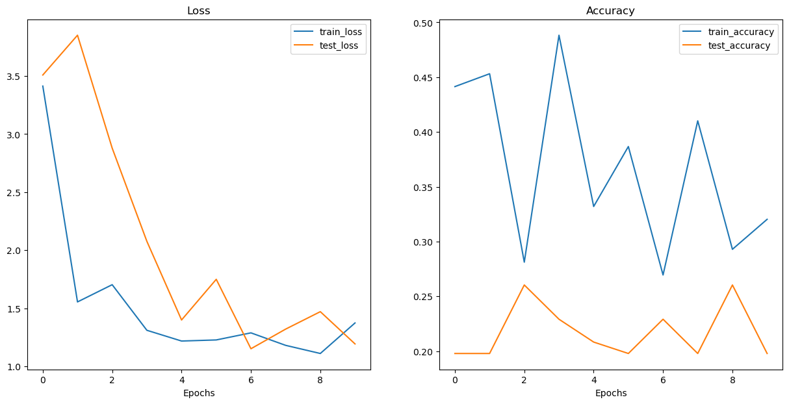
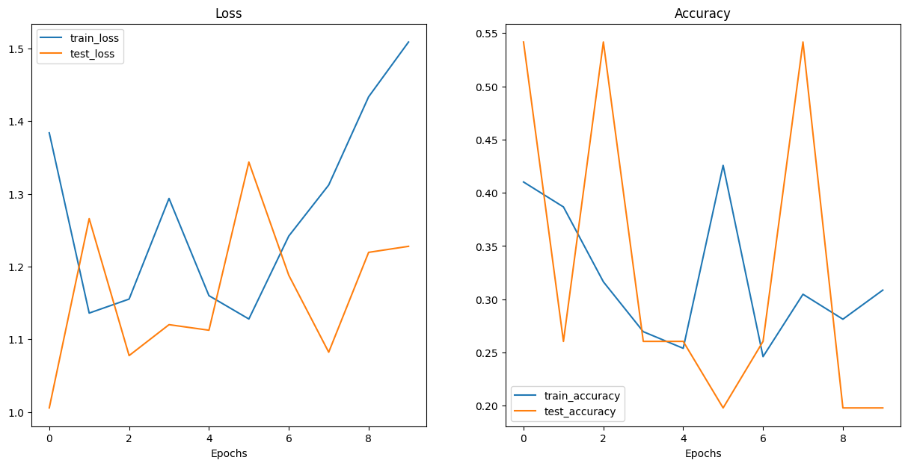

# CoPE-ViT-Enhancement
This project implements a novel contextual position embedding technique (CoPE) in Vision Transformers (ViT) to improve their performance. The repository contains the implementation, training scripts, and evaluation metrics.


## Overview

Traditional Vision Transformers use fixed position embeddings to retain spatial information. This project replaces the fixed position embeddings with a novel contextual position embedding technique (CoPE) that adapts based on the input data. The CoPE method is inspired by recent advancements in position encoding for large language models.

## Key Features

- Build ViT-B/16 architreture as per the ViT paper. 
- Implementation of CoPE in ViT architecture.
- Comparative analysis of traditional position embeddings versus CoPE.
- Scripts for training the model on various datasets.


## Table of Contents

- [Installation](#installation)
- [Usage](#usage)
  - [Training](#training)
- [Results](#results)
- [Contributing](#contributing)
- [License](#license)


## Installation

1. Clone the repository:

   ```bash
   git clone https://github.com/your-username/CoPE-ViT-Enhancement.git
   cd CoPE-ViT-Enhancement
   ```

2. Create a conda environment using the provided `environment.yml` file:

    ```bash
    conda env create -f environment.yml
    conda activate vision_env
    ```

3. Install the package:

    ```bash
    pip install -e .
    ```


## Usage

### Training

To train the ViT model with CoPE:

```bash
python training_ViT.py
```


## Results

The performance of the ViT model using CoPE has shown improved results compared to the absolute encoding method. The model was trained on a small dataset consisting of images of food items (pizza, steak, sushi). Given the limited size of the dataset, the training and testing loss and accuracy curves exhibit some variability. But, we see advantages of using CoPE over relative PE. The following plots demonstrate the loss and accuracy trends:

### Loss and Accuracy Plots of CoPE_ViT



### Analysis

- **Loss**: Both the training and test loss decreased steadily, indicating effective learning and generalization.
- **Accuracy**: The training accuracy increased with some fluctuations, while the test accuracy also improved but at a lower rate.

### Loss and Accuracy Plots of ViT using relative positional encoding




## Contributing

Contributions are welcome! Please fork the repository and submit a pull request for any enhancements or bug fixes.

1. Fork the repository.
2. Create a feature branch (`git checkout -b feature-branch`).
3. Commit your changes (`git commit -am 'Add new feature'`).
4. Push to the branch (`git push origin feature-branch`).
5. Create a new pull request.

## License

This project is licensed under the MIT License - see the [LICENSE](LICENSE) file for details.


Contributing

We welcome contributions to this project. Please feel free to open issues and submit pull requests.

License

This project is licensed under the MIT License.

Acknowledgements

	•	The original Vision Transformer paper by Dosovitskiy et al. 
	•	The contextual position embedding paper by Golovneva et al. inspiring this work https://arxiv.org/pdf/2405.18719